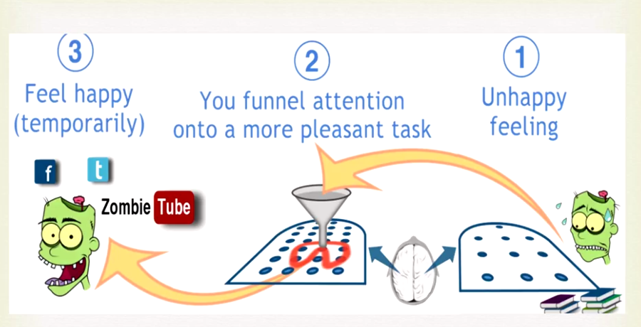
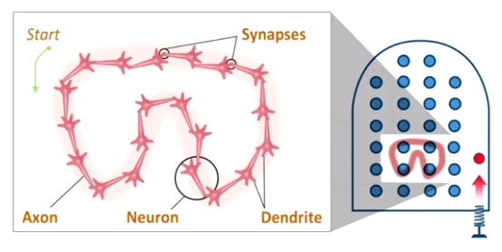
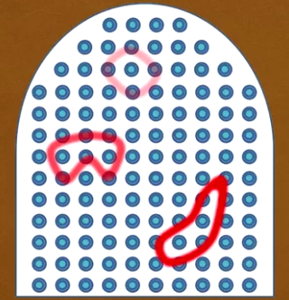

####Chapitre 01 : Procrastination

Tout le monde à plus ou moins de problèmes avec la procrastination, parce que si vous travaillez sur quelque chose, cela veut dire que vous ne travailler pas sur toutes ces autres choses que vous souhaiteriez faire. Certaines personnes ont plus de problèmes avec la procrastination que d'autres.

Nous allons voir comment la procrastination apparaît et des petits outils puissant pour nous aider à y répondre. Quand vous regardez quelque chose que vous ne souhaitez vraiment pas faire, il semble que vous activiez des zones de votre cerveaux qui sont associé à la douleur. D'une manière naturelle notre cerveau cherche un moyen pour arrêter cette stimulation négative et diriger notre attention sur quelque chose d'autre. 

Voilà l'astuce, des chercheurs ont découverts que lorsque l'on travail complètement à ce que nous n'aimions pas, l'inconfort neuronal disparaît.

On pourrait schématiser de cette façon comment la procrastination fonctionne.

**Premièrement** on observe et on reçoit un signal à propos de quelque chose qui crée un petit sentiment de malaise. **Deuxièmement**, Pour faire partir cette sensation, nous tournons alors notre attention de ce qui causait ce malaise et on la tourne vers quelque chose de plus agréable. **Finalement**, le résultat est de se sentir plus heureux de manière temporaire.

Voici un petit outil mental pratique :

Il s'appel le pomodoro (italien tomate) qui a été inventé par Francesco Cirillo en 1980, il s'agit simplement d'un minuteur.

>Il s'agit de le régler sur **25 minutes** et de se **concentrer** uniquement sans aucune interruption. C'est tout. Ensuite il est important de se donner une petite **récompense**, surfer sur le net, boire un thé, faire une promenade, discuter avec des amis, avec soi-même, ou manger un morceau de chocolat Cela permet à son esprit de cesser de se concentrer.

C'est une technique très efficace, c'est comme faire 25 minute d'efforts gymnastiques intense puis de se relaxer mentalement.

**La pratique rend permanent**

La complexité à apprendre les maths et les sciences sont un exemple intéressant dans la mesure où ils implique une connaissance abstraite, (contrairement à par exemple, apprendre le noms d'animaux en voyant une image directe et réel de cet animal, ou des concepts comme amour, espoir qui sont relié à des émotions) pour les idées abstraites, il n'y a souvent pas d’analogie dans le monde réel pour s'y référer

Il est important de mettre en pratique (amener dans la réalité) les concepts que l'on apprend en math et science, tout comme tout ce que l'on apprend pour nous aider à améliorer et renforcer les connections neuronales que nous fabriquons lors du processus d'apprentissage.

On peut voir ici la représentation symbolique d'un schéma de pensée, les neurons se lient les uns les autres par la répétition d'usage. Plus des choses sont abstraites, plus il est important de mettre en pratique ces idées pour les amener dans notre réalité. Car même si ces idées sont abstraites, les schéma de pensée neuronal que nous créons sont eux réels et concrets. Du moins il le sont si vous les construisez et les renforcez à travers la pratique.

Voici un moyen d'illustrer ce qu'il se passe :

Quand nous commençons à comprendre quelque chose, par exemple, comment résoudre un problème, un peu comme le trait léger en rouge clair en haut de notre analogie d'esprit flipper, quand nous résolvons de nouveau la solution à notre problème sans regarder la solution, nous commençons à approfondir ce schéma neuronal, un peut comme le trait rouge du milieu, un peu plus visible et lorsque vous résolvez votre problème à partir de zéro et d'autres problèmes lié à celui-ci, nous inscrivons plus profondément notre connaissance. (trait le plus visible) 

La pratique rend permanent, lorsque vous voulez étudier quelque chose, faites y attention complètement un temps, puis faites une pause, changer votre attention sur des choses différentes. Ce temps de repos permet au mode diffus d'avoir le temps de travailler dans le fond et d'aider à la compréhension conceptuelle, dans un sens, le ciment des structures neuronales on un temps pour sécher ce qui est très difficile en garant simplement de la concentration et ne pas laisser le temps au structures neuronales de s'installer.

Le minuteur (pomodoro) pourrait nous aider à avancer, en ayant chaque jour de courte période de temps ou la concentration sur le sujet et laisser du temps de repos/récompenses/relaxation mental pour laisser la compréhension se faire. Cette méthode permettrait de réussir à apprendre des sujets difficiles.