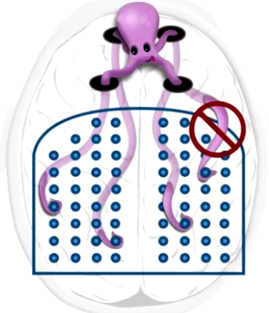
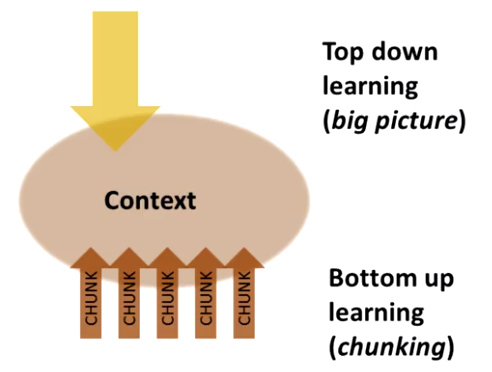

#Comment former des groupements ?

Si l'on souhaite créer une chanson difficile à la guitare, la représentation neuronal de la chanson dans notre esprit peut être considéré comme un groupement plutôt large.

-Vous allez d'abord écouter la chanson, peut être allez vous regarder quelqu'un d'autre jouer la chanson si vous êtes débutant et que vous apprenez à tenir une guitare. Le schéma d'apprentissage est toujours le même quelque soit le sujet appris, nous commençons à agriper des petit morceaux d'informations qui formeront des mini-groupements qui rejoindront plus tard un groupement plus large.

- Par exemple, pendant plusieurs jours, vous pouvez jouer des petit passages de musique sur la guitare et une fois que vous avez compris ces passages, vous pouvez les joindres ensemble afin de formet le morceau complet.

- Pour apprendre un sport quelqu'il soit, vous apprenez à maîtriser les aptitudes séparéments que vous avez besoin, tirer au balon pour atteindre le but, se déplacer rapidement. Tout cela represente des petits groupement neuronaux qui peuvent être tricoté ensemble dans des groupements plus large. Plus tard vous pouvez ensuite mixer ces larges groupement en groupements complexe que l'on utilise facilement afin d'être réactif à n'importe qu'elle situation sur un sujet que l'on maîtrise.

- Les meilleurs groupements sont ceux qui sont tellement bien enraciné, qu'il n'est plus nécessaire d'y penser consciemment pour s'assurer que les schémas neuronaux sont bien connecté entre eux. C'est d'ailleurs le but de la réalisation d'idées complexes, de mouvements et de réaction dans un groupement.

- Dans l'apprentissage d'une langue, simplement dire un mot avec la bonne nuance, le bon ton et le bon accent implique une grande quantité de pratique. Assembler des phrases implique la capacité de mélanger des petit groupement complexes pour former le grand groupement du nouveau language.

- Pour les math et les sciences, cette même méthode est appliqué, lorsque l'on étudie des problèmes à résoudre, nous les étudions souvent avec leurs solutions afin d'avancer dans la découverte de leur résolution. Il s'agit alors non pas de comprendre comment obtenir la solution en elle-même, mais de comprendre l'interconnection des étapes qui ont amené à cette solution. Le fonctionnement d'une étape isolé du processus total de la résolution du problème globale empêche un renforcement du groupement neuronal. Si l'on apprend seulement les étapes une aprés les autres pour résoudre un problème aveuglément, la compréhension se fait plutôt par la capacité de suivre une sorte de carte qui même à la destination, la découverte de l'environnement autour de la map permet de mieux comprendre le chemin et pourrait aussi permettre de découvrir de nouveaux chemins. "Le chemin est plus important que la destination" pour que la structure neuronale soit forte.

**Étapes de bases pour la construction d'un groupement**

Toutes les disciplines sont différentes, un groupement sur l'histoire est différent d'un groupement de chimie ou de karaté. Nous allons expliquer surtout comment les idées sont regroupé plutôt que les mouvements physiques, mais nous verrons que les deux approches sont lié, que vous appreniez quelques chose de mental ou de physique.

1. la première étape pour faire un groupement est de se **concentrer** avec une attention non divisé sur l'information que vous souhaitez grouper. Il est important de ne pas avoir de disctraction (télévion, téléphone) qui rendrait difficile le groupement des nouvelles informations. Quand vous apprennez quelque chose de nouveau, vous créez de nouveaux schémas neuronals qui se connectent à des schéma préexistant qui sont répandu dans de nombreuses zones du cerveau, les tentacules de votre poulpe ne peuvent pas les atteindres correctemment si vos pensées se trouve ailleurs et empéchant l'utilisation optimale des quatres emplacements de la mémoire de travail.

2. La deuxième étape est de **comprendre** l'idée de base que vous essayer de grouper, que ce soit un concept comme la formation de la terre ou comprendre un certain type de problème mathématique. Il est possible de synthétiser l'idée générale, de l'approcher naturellement en laissant les deux modes focus et et diffuse de fonctionner. Comprendre c'est comme une super colle, cela crée des traces mémoriels larges qui permettent de se connecter aux autres traces. On peut créer un groupement sans comprendre, mais celui ci sera isolé et ne pourra pas se connecter au reste, il sera inutile à l'apprentissage global.

Il est important de savoir que simplement comprendre comment résoudre un problème ne cré par necessairement un groupmement, on peut attraper une idée lorsqu'elle est présenté, mais si on ne la **revoit** pas fréquemment, elle finit par s'effacer. S'évaluer soi-même accélère l'apprentissage, car penser une nouvelle fois aux étapes et résoudre une nouvelle fois un problème permet de renforcer le groupement. Voir, entendre ou comprendre une chose pour la première fois ne signifie pas que vous pouvez le faire. La première fois que vous comprenez vraiment quelque chose, c'est en réalité au moment ou vous pouvez le faire par vous-même. 

3. La troisième étape pour la construction d'un groupement est de le placer dans un **contexte**, ce qui veut dire ne pas seulement savoir comment l'utiliser mais aussi quand l'utiliser. Le contexte signifi aller au delà du problème initial et de voir plus globalement, en **le pratiquant et le répétant** avec des problèmes qui ne sont pas lié immédiatement à ce groupement ce qui permet de savoir quand utiliser ce groupement mais aussi quand ne pas l'utiliser.Cela permet de savoir comment se place votre nouveau groupement dans une perspective plus vaste. C'est comme avoir un outil dans sa boite à outils et savoir à quel moment s'en servir, sinon il ne servirait à rien. La pratique permet d'élargir le réseau de neurones qui sont connecté à ce groupement, ce qui lui permet non seulement d'être solide mais aussi accessible par différents chemins.

Comme on peut le voir sur l'image, l'apprentissage se déroule de deux manières. Il y a un processus du bas vers le haut de construction de groupements qui par la pratique et la répétition aide à la fois à construire et à renforcer chaque groupement(chunk) de manière à y accéder facilement quand vous en avez besoin. Il y a aussi un processus du haut vers le bas, qui est la perspective globale qui permet de voir ce que l'on apprend et comment cela s'assemble. Les deux processus sont vitals pour réussir à maitriser l'information. Le context est là ou les groupements et la perspective globale se retrouve.

Pour simplifier, disons que le groupement implique par exemple comment utiliser une certaine technique pour résoudre un problème. Le contexte signifi quand utiliser cette technique plutôt qu'une autre. Par exemple lire sommairement un livre avant de commencer à l'étudier, ou d'écouter un cours bien organisé permet d'avoir une idée du plan contextuel global dans lequel tout les groupements vont s'assembler les uns avec les autres. Les points clés sont à apprendre en premier, comme les piliers ou le cadre dans lequel vont ensuite s'assembler les groupements en construction.

Les groupements se forment donc avec une **attention concentré**, la **compréhension** et la **pratique** sont les étapes qui permettent d'assembler les groupements dans un contexte globale de ce que vous apprenez.

