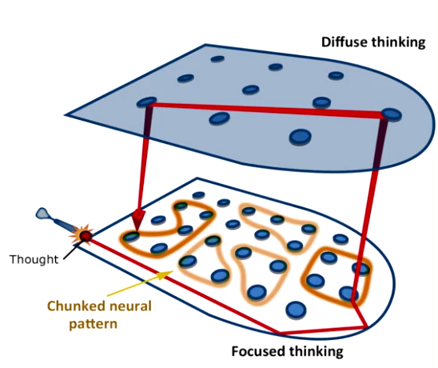
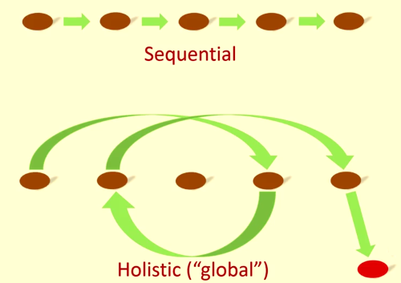

# Voir le contexte général
### La valeur de la bibliothèque des groupements

Les personne qui souhaite augmenter leurs connaissances et leur expertise est d'augmenter progressivement le nombre de groupement dans leur esprit. Des informations de valeurs qu'ils peuvent combiner ensemble de manière neuve et créative. (par exemple, un maître de jeu d'echec peut accéder à des milliers de schémas d'echec)

Plus vos groupements sont grand est mis en pratique, peu importe le sujet, plus vous serais capable facilement de résoudre un problème et trouver des solutions. Comme nous le verrons plus tard, le groupement n'est pas suffisant pour développer une flexibilité créative dans votre apprentissage. Mais c'est tout de même un composant très important.

Les groupements peuvent vous aider à comprendre de nouveaux concepts. La raison en est que lorsque vous choisissez un groupement, vous découvrez qu'il peut être mis en relation avec d'autre groupements similaires qui ne sont pas forcément du même domaine de connaissance. Cette idée est appelé tranfert. Par exemple, des concepts et des méthodes de résolution de problèmes que vous avez appris en physique peuvent être similaire à des groupements de concepts lié aux affaires. Ou par exemple lorsque j'ai découvert que mes connaissance du language m'ont été utile lorsque j'ai appris à programmer sur ordinateur.

Un groupement est un moyen de compresser l'information de manière bien plus compacte. Lorsque l'on gagne de l'expérience dans le groupement de n'importe quel sujet, vous verrez que les groupements que vous pouvez créer sont plus grand. Non seulement ils sont plus étendus, mais aussi ils sont plus dense, solidement enraciné dans la mémoire.

Si nous avons une bibliotèques intérieure de concepts et de solutions au sein de groupements, il s'agit d'une sorte de collection de schémas neuronals. Si vous essayez de résoudre un problème et que vous avez une bonne librairie de ces groupements, nous pouvons alors trouver plus facilement la solution en écoutant d'une manière métaphorique les chuchotements du mode diffus. Le mode diffus peut aider à connecter deux groupements ensemble d'une nouvelle manière pour résoudre un nouveau problème.

Une autre façon d'y penser est alors que vous construisez des groupements, ils remplissent une partie du contexte plus large de la connaissance. Si vous ne mettez pas en pratique vos nouveaux groupements, ils vont rester flou et il sera plus difficile de mettre en relation c'est jeunes groupements avec le contexte générale de ce que vous essayez d'apprendre. En construisant une bibliothèque de groupement vous entrainé votre cerveau à reconnaitre à la fois un concept spécifique mais aussi différentes sortes et catégories de concepts que vous pouvez utilisez automatiquement pour résoudre ou faire face à tout ce que vous rencontrer.
Vous commencerez à voir des schémas qui simplifie pour vous la résolution du problème et vous trouverez bientôt une solution technique différente qui se trouve dans un coin de votre mémoire.

Il y a deux façon de comprendre quelque chose ou de résoudre un problème :

* Il y a le raisonnement séquentiel, étape par étape.
* Le second est plus une forme d'intuition holistique.

Le raisonnement séquentiel, ou chaque étape mène délibérément à une solution demande le mode concentré (focus), l'intuition d'un autre côté nécessite ce mode créatif diffus qui relit les pensées du mode concentré qui semblent différentes les unes des autres. Les problèmes et les concepts les plus difficiles sont saisi grace à l'intuition parce que ces nouvelles idées se trouve éloigné de ce vers quoi vous êtes familier. Le mode diffus qui réalise des connections de manière semi-aléatoire signifi que les solutions qu'elles proposent doivent être vérifié en utilisant le mode concentré(focus). Les perception intuitive ne sont pas toujours juste.

* **Loi de sérendipité**

Vous pouvez penser qu'il y a tellement de problèmes dans le prochain chapitre ou le prochain cours que vous étudiez, et qu'il n'est pas possible de les apprendre tous. C'est là que la loi de sérenpidité entre en jeu. Il suffit de se concentrer sur un premier problème et de le mettre dans sa bibliothèque mentale, quel qu'il soit, alors le deuxième concept sera plus simple à saisir. Et le troisième encore plus facilement. Non pas que tout se fait en un claquement de doigt, mais le chemin devient plus facile.